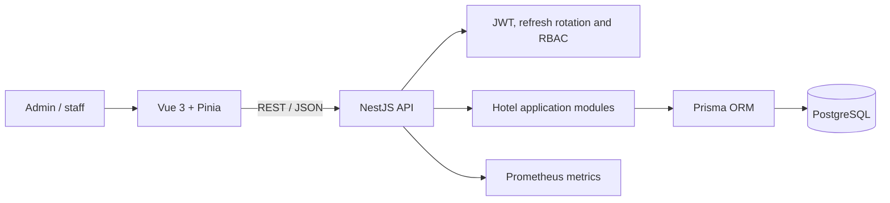

# Hotel Operations PMS — NestJS + Vue Reference

**Full-stack hotel operations system built with NestJS, Prisma, PostgreSQL and Vue 3.**

This repository is the portfolio reference for the **TypeScript/NestJS backend stack**. It contains authentication, authorization, hotel workflows, typed frontend integration, test infrastructure, security controls and operational metrics.

It is intentionally separate from **HMS Elite**, the Rust/React multi-hotel SaaS implementation. This repository shows the TypeScript implementation path, but it is not currently release-ready.

> **Current status:** active reference implementation with a red CI baseline. The latest review found one frontend TypeScript error and 415 backend lint findings. Test and E2E tooling exists, but passing-build and passing-test claims remain unverified until the quality baseline is restored.

## What this project demonstrates

| Area | Repository evidence |
|---|---|
| Backend development | NestJS 11, TypeScript, Prisma and PostgreSQL |
| Frontend development | Vue 3, Pinia, Vite, TypeScript and Tailwind CSS |
| API design | Versioned REST API, DTO validation and Swagger/OpenAPI |
| Authentication | Short-lived access tokens, HttpOnly refresh cookies and token rotation |
| Authorization | Administrator and staff restrictions |
| Test infrastructure | Jest/Supertest, Vitest and Playwright configuration |
| Security design | Bcrypt, Helmet, CSP, throttling and refresh-token reuse detection |
| Operations | Docker Compose, production Dockerfiles and protected Prometheus metrics |

## Current quality baseline

The repository has meaningful QA infrastructure, but the latest GitHub Actions run is **not green**:

- Frontend lint passes, but the production build is blocked by a grouping type mismatch in `AppSidebar.vue`.
- Backend lint reports **415 findings**: many are formatting corrections, while others involve unsafe `any` usage and require deliberate refactoring.
- Backend build/tests and frontend unit/E2E stages were not reached in that run because earlier gates failed.
- Dependency audits report vulnerabilities that require triage before a public deployment.

For that reason, this repository should be presented as **technical evidence under remediation**, not as a stable release.

## Main workflows present in the codebase

- Authenticate administrators and staff.
- Manage rooms and room states.
- Enforce role-specific permissions.
- Perform check-in and check-out operations.
- Maintain access/refresh sessions.
- Expose protected runtime metrics.
- Configure backend and browser E2E journeys.

## Architecture



## Technology stack

### Backend

- NestJS 11 and TypeScript.
- Prisma 6 and PostgreSQL.
- JWT access and refresh sessions.
- Class Validator / Class Transformer.
- Swagger / OpenAPI.
- Helmet, cookie parsing and throttling.
- Prometheus client metrics.
- Jest and Supertest.

### Frontend

- Vue 3 and TypeScript.
- Pinia, Vite and Tailwind CSS 4.
- Axios, Vitest and Playwright.

### Infrastructure

- Docker and Docker Compose.
- Development and production Dockerfiles.
- PostgreSQL container.
- Browser E2E container support.

## Security approach

- Access tokens expire after a short period.
- Refresh tokens use HttpOnly cookies.
- Refresh-token families support rotation and reuse detection.
- Passwords are stored with bcrypt hashes.
- The frontend keeps the access token in memory rather than `localStorage`.
- Helmet, CSP and API throttling provide baseline hardening.
- Metrics require a separate bearer token.

These are implementation controls, not evidence of formal certification. A production deployment still requires secret management, dependency remediation, threat modelling, privacy review and security testing.

## Quick start

### Requirements

- Docker.
- Docker Compose.

### Configure

```bash
cp .env.example .env
```

The committed template contains development-only placeholders. Replace all secrets before any shared deployment.

### Run

```bash
docker compose --env-file .env up --build
```

| Service | Address |
|---|---|
| Backend API | `http://localhost:3000/api/v1` |
| Frontend | `http://localhost:5173` |
| Protected metrics | `http://localhost:3000/metrics` |

## Quality commands

These commands describe the intended validation workflow. They should not be considered passing until CI is restored.

```bash
cd backend
npm ci
npm run lint
npm run build
npm run test
npm run test:e2e
```

```bash
cd frontend
npm ci
npm run lint
npm run build
npm run test
npm run test:e2e
```

## API

Base prefix: `/api/v1`

Reference documentation:

- `API.md`
- Swagger/OpenAPI exposed by the backend.

`API.txt` should be removed or generated from the canonical contract to avoid documentation drift.

## Documentation

- [Portfolio case study](docs/PORTFOLIO_CASE_STUDY.md)
- [Implementation status](docs/PROJECT_STATUS.md)
- `API.md`

## Remediation priorities

1. Fix the `AppSidebar.vue` grouping type mismatch.
2. Apply safe formatter/ESLint auto-fixes separately from semantic changes.
3. Remove unsafe `any` usage in authentication, middleware, interceptors and tests.
4. Restore backend/frontend build and test stages.
5. Triage dependency vulnerabilities.
6. Consolidate API documentation.
7. Add screenshots only after the release baseline is green.

## Scope note

This repository is a full-stack TypeScript reference implementation under remediation. It should not be advertised as production-ready or as having a passing QA baseline until the open quality-debt work is completed.