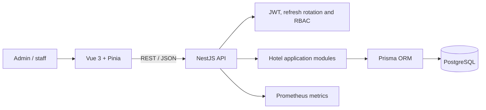

# Hotel Operations PMS — NestJS + Vue Reference

**Full-stack hotel operations system built with NestJS, Prisma, PostgreSQL and Vue 3.**

This repository is the portfolio reference for the **TypeScript/NestJS backend stack**. It demonstrates authentication, authorization, transactional hotel workflows, typed frontend integration, automated E2E testing, security hardening and operational metrics.

It is intentionally presented separately from **HMS Elite**, the Rust/React multi-hotel SaaS implementation. The purpose of this repository is to show equivalent full-stack capability using an enterprise TypeScript stack.

> **Status:** functional reference implementation under active refinement. Core hotel workflows, authentication, E2E testing and metrics are implemented; verified screenshots, a hosted demo and a stable tagged release remain pending.

## What this project demonstrates

| Area | Evidence |
|---|---|
| Backend development | NestJS 11, TypeScript, Prisma and PostgreSQL |
| Frontend development | Vue 3, Pinia, Vite, TypeScript and Tailwind CSS |
| API design | Versioned REST API, DTO validation and Swagger/OpenAPI |
| Authentication | Short-lived access tokens, HttpOnly refresh cookies and token rotation |
| Authorization | Administrator and staff role restrictions |
| QA | Jest/Supertest backend E2E, Vitest and Playwright browser E2E |
| Security | Bcrypt, Helmet, CSP, throttling and refresh-token reuse detection |
| Operations | Docker Compose, production Dockerfiles and protected Prometheus metrics |

## Main workflows

- Authenticate administrators and staff.
- Manage rooms and room states.
- Enforce role-specific permissions.
- Perform check-in and check-out operations.
- Maintain access/refresh sessions safely.
- Expose protected runtime metrics.
- Validate complete frontend/backend journeys with Playwright.

## Architecture



The implementation uses a conventional modular NestJS architecture. Prisma manages the relational data model and migrations, while Vue consumes the versioned API through a typed frontend workflow.

## Technology stack

### Backend

- NestJS 11 and TypeScript.
- Prisma 6 and PostgreSQL.
- JWT access and refresh sessions.
- Class Validator / Class Transformer.
- Swagger / OpenAPI.
- Helmet, cookie parsing and throttling.
- Prometheus client metrics.
- Jest and Supertest.

### Frontend

- Vue 3 and TypeScript.
- Pinia.
- Vite.
- Tailwind CSS 4.
- Axios.
- Vitest.
- Playwright.

### Infrastructure

- Docker and Docker Compose.
- Development and production Dockerfiles.
- PostgreSQL container.
- Browser E2E container support.

## Security approach

- Access tokens expire after a short period.
- Refresh tokens use HttpOnly cookies.
- Refresh-token families support rotation and reuse detection.
- Passwords are stored with bcrypt hashes.
- The frontend keeps the access token in memory rather than `localStorage`.
- Helmet and CSP provide baseline browser hardening.
- API throttling limits abusive request patterns.
- Metrics require a dedicated bearer token.

These controls are an engineering baseline, not a formal security certification. A production deployment still requires deployment-specific secret management, threat modelling, privacy review and penetration testing.

## Quality strategy

### Backend E2E

The backend test suite validates complete API behaviour, including:

- Unauthenticated access rejection.
- Administrator room creation.
- Staff authorization restrictions.
- Check-in and check-out flow.

Run:

```bash
docker compose exec backend npm run test:e2e
```

### Frontend and browser E2E

```bash
cd frontend
npm install
npm run test
npx playwright install --with-deps
npm run test:e2e
```

Containerized browser E2E:

```bash
docker compose --env-file .env up -d
docker compose --env-file .env run --rm playwright bash -lc "npm ci && npm run test:e2e"
```

## Quick start

### Requirements

- Docker.
- Docker Compose.

### Configure

```bash
cp .env.example .env
```

The committed `.env.example` uses development-only placeholders. Replace all secret values before any shared or public deployment.

### Run

```bash
docker compose --env-file .env up --build
```

| Service | Address |
|---|---|
| Backend API | `http://localhost:3000/api/v1` |
| Frontend | `http://localhost:5173` |
| Protected metrics | `http://localhost:3000/metrics` |

### Seed development data

```bash
docker compose exec backend npx prisma db seed
```

Seed accounts are intended only for local development. Their credentials must not be reused outside the local environment.

## Run without Docker

### Backend

```bash
cd backend
npm install
npx prisma generate
npm run start:dev
```

### Frontend

```bash
cd frontend
npm install
npm run dev
```

## API

Base prefix:

```text
/api/v1
```

Reference documentation:

- `API.md`
- Swagger/OpenAPI exposed by the backend.

`API.txt` is retained only if another tool still consumes it; otherwise it should be removed to avoid maintaining duplicate API documentation.

## Observability

Metrics require the configured token:

```bash
curl -H "Authorization: Bearer $METRICS_TOKEN" http://localhost:3000/metrics
```

Recommended monitoring signals include:

- HTTP 5xx error ratio.
- p95 request latency.
- Unexpected traffic absence.
- Authentication failure spikes.

## Documentation

- [Portfolio case study](docs/PORTFOLIO_CASE_STUDY.md)
- [Implementation status](docs/PROJECT_STATUS.md)
- `API.md`

## Current priorities

- Add verified screenshots for administrator and staff flows.
- Publish a controlled demonstration environment.
- Consolidate duplicate API documentation.
- Expand authorization and session-security regression coverage.
- Tag a stable TypeScript-stack portfolio release.

## Scope note

This repository is a full-stack TypeScript reference implementation. Production adoption would additionally require organization-specific privacy, compliance, monitoring, infrastructure and support validation.