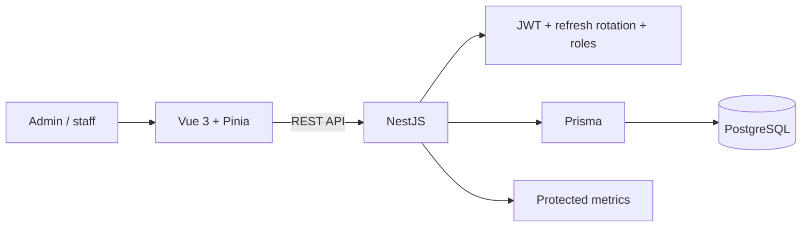

# Hotel Operations PMS — Portfolio Case Study

## Executive summary

This project is a full-stack hotel operations reference implementation using NestJS, Prisma, PostgreSQL and Vue 3. It demonstrates the structure of a TypeScript delivery path from API and relational modelling to frontend state, authentication, metrics and automated-test tooling.

The repository is intentionally distinct from HMS Elite. HMS Elite demonstrates the stronger current release baseline with Rust/React; this project demonstrates enterprise TypeScript and NestJS capability while its CI debt is remediated.

## Problem

Hotel staff need one consistent workflow for room status, check-in, check-out and role-specific access. A useful PMS must prevent unauthorized operations, preserve session security and keep frontend/backend behaviour aligned.

## Solution

## Key decisions

### NestJS modular backend

NestJS provides modules, dependency injection, validation and testing support suitable for a conventional business application.

### Prisma persistence

Prisma supplies a typed database client and versioned schema workflow, reducing mismatch between TypeScript models and PostgreSQL.

### Access token in memory

The frontend avoids storing the access token in `localStorage`. Refresh sessions use HttpOnly cookies, reducing direct token exposure to browser scripts.

### Refresh rotation and reuse detection

Refresh tokens are treated as session families rather than indefinitely reusable credentials. Rotation and reuse detection improve the security design.

### Test infrastructure across layers

The repository contains Jest/Supertest, Vitest and Playwright tooling and specifications. However, the latest reviewed CI run did not reach a green build-and-test baseline, so these should be described as configured infrastructure rather than currently passing evidence.

## Current quality evidence

### Present in the repository

- NestJS/Jest and Supertest tooling.
- Vue/Vitest tooling.
- Playwright browser-E2E configuration.
- Bcrypt password hashing.
- Helmet and CSP baseline hardening.
- API throttling.
- Protected Prometheus metrics.
- Dockerized local environment.

### Current blockers

- One frontend production-build type error in `AppSidebar.vue`.
- 415 backend lint findings, including formatting debt and unsafe typing.
- Build and test completion not verified after the failing earlier gates.
- Dependency vulnerabilities requiring triage.

Therefore the project is useful architecture and implementation evidence, but not a stable QA claim.

## Trade-offs

### Benefits

- One language across frontend and backend.
- Strong framework conventions and rapid iteration.
- Typed persistence and DTO validation.
- Straightforward onboarding for TypeScript teams after the quality baseline is restored.

### Costs

- Framework conventions can hide architectural decisions if modules are not kept explicit.
- Refresh-session logic adds operational and testing complexity.
- Large accumulated lint/type debt weakens trust in otherwise useful test infrastructure.
- Duplicate API documents can drift if not consolidated.

## Current limitations

- CI is red and the repository is not release-ready.
- No public hosted demo.
- No verified screenshots or walkthrough.
- No tagged stable portfolio release.
- Duplicate API documentation requires consolidation.
- Production-specific privacy, monitoring and security review remain outside current evidence.

## Next milestones

1. Fix the frontend grouping type mismatch.
2. Split mechanical backend formatting from semantic type-safety remediation.
3. Restore green builds and all test stages.
4. Triage dependency vulnerabilities.
5. Consolidate API documentation around one canonical contract.
6. Capture screenshots and publish a demo only from a green release commit.

## Professional relevance

The repository demonstrates full-stack TypeScript structure, backend API design, session-security concepts, relational persistence and frontend integration. It also provides an honest example of why configured QA tooling is not equivalent to a passing quality baseline.