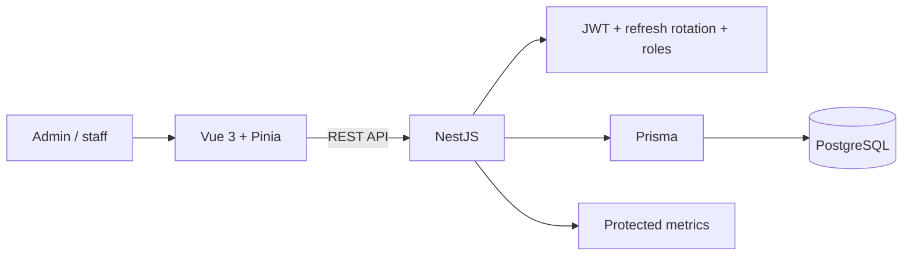

# Hotel Operations PMS — Portfolio Case Study

## Executive summary

This project is a full-stack hotel operations reference implementation using NestJS, Prisma, PostgreSQL and Vue 3. It demonstrates a complete TypeScript delivery path from API and relational modelling to frontend state, authentication, browser E2E and operational metrics.

The repository is intentionally distinct from HMS Elite. HMS Elite demonstrates Rust/React architecture at a broader SaaS scale; this project demonstrates enterprise TypeScript and NestJS capability.

## Problem

Hotel staff need one consistent workflow for room status, check-in, check-out and role-specific access. A useful PMS must prevent unauthorized operations, preserve session security and keep frontend/backend behaviour aligned.

## Solution

## Key decisions

### NestJS modular backend

NestJS provides explicit modules, dependency injection, validation and testing support suitable for a conventional business application.

### Prisma persistence

Prisma supplies a typed database client and versioned schema workflow, reducing mismatch between TypeScript models and PostgreSQL.

### Access token in memory

The frontend avoids storing the access token in `localStorage`. Refresh sessions use HttpOnly cookies, reducing direct token exposure to browser scripts.

### Refresh rotation and reuse detection

Refresh tokens are treated as session families rather than indefinitely reusable credentials. Rotation and reuse detection improve the security baseline.

### Complete-flow testing

The backend E2E suite verifies authentication, administrator/staff restrictions and check-in/check-out behaviour. Playwright validates the integrated browser workflow.

## Quality and security evidence

- NestJS/Jest unit and E2E tooling.
- Supertest API validation.
- Vue/Vitest frontend tests.
- Playwright browser E2E.
- Bcrypt password hashing.
- Helmet and CSP baseline hardening.
- API throttling.
- Protected Prometheus metrics.
- Dockerized local environment.

## Trade-offs

### Benefits

- One language across frontend and backend.
- Strong framework conventions and rapid iteration.
- Typed persistence and DTO validation.
- Straightforward onboarding for TypeScript teams.

### Costs

- Framework conventions can hide architectural decisions if modules are not kept explicit.
- Refresh-session logic adds operational and testing complexity.
- Duplicate API documents can drift if not consolidated.
- A portfolio implementation still requires real-user and production validation.

## Current limitations

- No public hosted demo.
- No verified screenshots or walkthrough.
- No tagged stable portfolio release.
- Duplicate API documentation requires consolidation.
- Production-specific privacy, monitoring and security review remain outside current evidence.

## Next milestones

1. Capture administrator and staff workflow screenshots.
2. Consolidate API documentation around Swagger/OpenAPI and one maintained Markdown reference.
3. Expand session-security and authorization regression tests.
4. Publish a controlled demonstration environment.
5. Tag a stable NestJS/Vue portfolio release.

## Professional relevance

The repository demonstrates full-stack TypeScript delivery, backend API design, session security, relational persistence, frontend integration and automated QA for an operational business system.